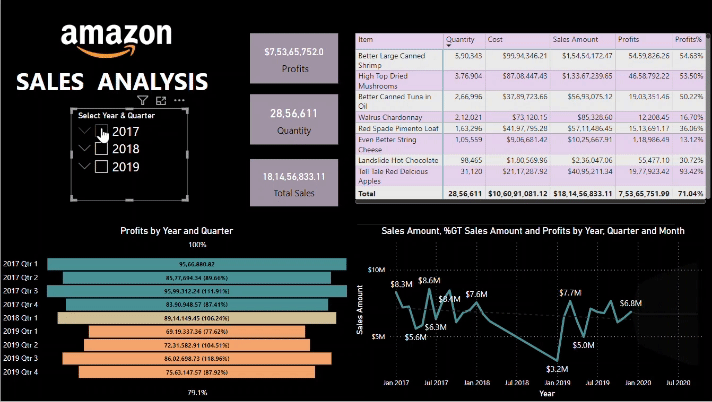
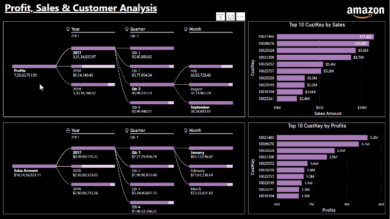

# Amazon Sales Data Analysis

## Overview

This project involves the analysis of Amazon sales data using a combination of PowerBI for creating interactive dashboards and Python for exploratory data analysis (EDA). The goal is to derive valuable insights from the sales data to aid decision-making and strategic planning.

  

## Table of Contents

1. [Introduction](#introduction)
2. [Requirements](#requirements)
3. [Project Structure](#project-structure)
4. [High-Level Design (HLD)](#high-level-design-hld)
5. [Low-Level Design (LLD)](#low-level-design-lld)
6. [Architecture](#architecture)
7. [Wireframe](#wireframe)
8. [Exploratory Data Analysis (EDA)](#exploratory-data-analysis-eda)
9. [PowerBI Dashboards](#powerbi-dashboards)
10. [Detailed Project Report (DPR)](#detailed-project-report-dpr)

## Introduction

This project aims to analyze Amazon sales data to gain insights into product performance, customer behavior, and market trends. The analysis is carried out using a combination of PowerBI for visualization and Python for in-depth exploratory data analysis.

## Requirements

- PowerBI Desktop
- Python 3.x
- Jupyter Notebook
- Pandas, NumPy, Matplotlib, Seaborn (Python libraries)
- Amazon sales data (CSV or Excel format)

## Project Structure

- **data/**: Contains the raw sales data.
- **notebooks/**: Jupyter notebooks for EDA.
- **reports/**: PowerBI dashboard files.
- **artifacts/**: Project Presentation.
- **docs/**: Documentation files.
- **PowerBI Dashboard File**

## High-Level Design (HLD)

The high-level design outlines the overall structure of the project, including the integration of PowerBI and Python for seamless analysis.

## Low-Level Design (LLD)

The low-level design provides detailed insights into the components of the project, specifying the functions of each module.

## Architecture

The architecture section describes the technical architecture of the project, explaining how PowerBI and Python components interact.

## Wireframe

Visual representation of the expected layout and design of the PowerBI dashboards.

## Exploratory Data Analysis (EDA)

Jupyter notebooks in the `notebooks/` directory provide a step-by-step analysis of the Amazon sales data using Python.

## PowerBI Dashboards

The `reports/` directory contains PowerBI dashboard files showcasing interactive visualizations and key performance indicators derived from the sales data.

### Detailed Project Report (DPR)

The detailed project report in the `docs/` directory provides a comprehensive overview of the project, including objectives, methodology, findings, and recommendations. It serves as a reference for stakeholders interested in a thorough understanding of the analysis.

For more information and detailed instructions, refer to the specific sections of the documentation.

**Note**: Before running any scripts or opening PowerBI dashboards, ensure that the required dependencies are installed.
